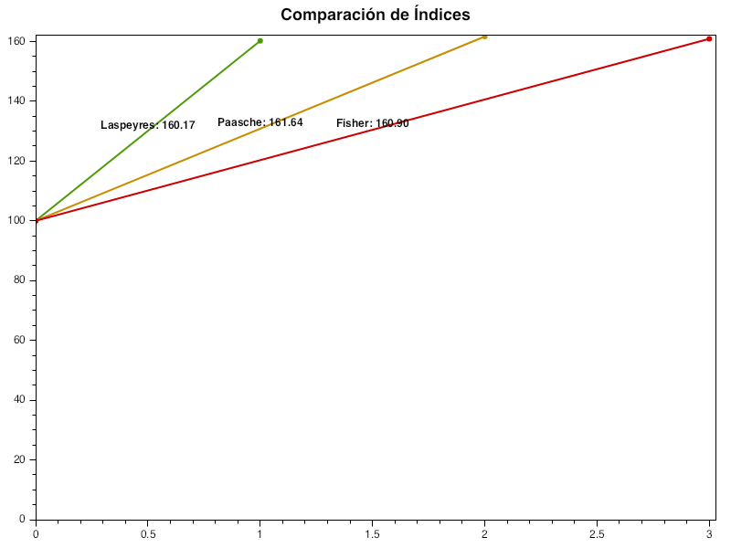
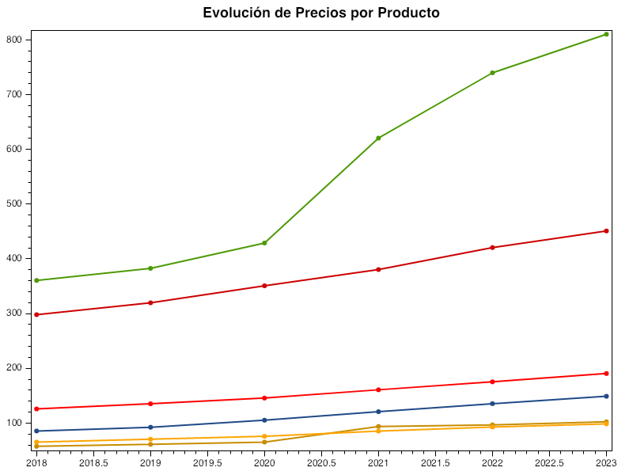

# Canasta API

## Descripción

Canasta API es un servicio web minimalista que permite calcular y visualizar índices de precios (Laspeyres, Paasche, Fisher) para un conjunto de productos. Además, proporciona gráficos de evolución de precios y comparación de índices.

Está desarrollado con **.NET 9**, **Entity Framework Core** y **OxyPlot** para gráficos, y se documenta automáticamente con **Swagger**.

---

## Características

* CRUD básico de productos y precios.
* Cálculo de índices económicos: Laspeyres, Paasche y Fisher.
* Visualización gráfica de productos y precios.
* Visualización gráfica de índices.
* Endpoints documentados con Swagger.

---

## Tecnologías

* .NET 9 Minimal API
* Entity Framework Core
* SQL Server (en contenedor Docker)
* OxyPlot (para generación de gráficos PNG)
* Swagger / OpenAPI

---

## Instalación

1. Clonar el repositorio:

```bash
git clone https://github.com/anderj14/CanastaBasica
```

2. Configurar la cadena de conexión en `appsettings.json`:

```json
"ConnectionStrings": {
    "DefaultConnection": "Server=TU_SERVIDOR;Database=CanastaDB;Trusted_Connection=True;"
}
```

3. Ejecutar la aplicación:

```bash
dotnet run
```

---

## Uso

* Swagger UI estará disponible en la raíz: `http://localhost:5284/`
* Ejemplos de endpoints:

  * `GET /productos` → Lista todos los productos con sus precios.
  * `GET /productos/{id}` → Obtiene un producto por su ID.
  * `POST /indices/Laspeyres/{anioBase}/{anioActual}` → Calcula el índice Laspeyres.
  * `GET /graficos/productos-precios-grafico` → Genera gráfico PNG de precios por producto.
  * `GET /graficos/indices/{anioBase}/{anioActual}` → Genera gráfico PNG de índices.

---

## Capturas


